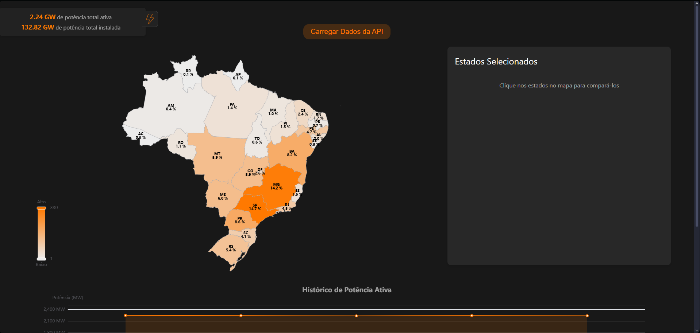
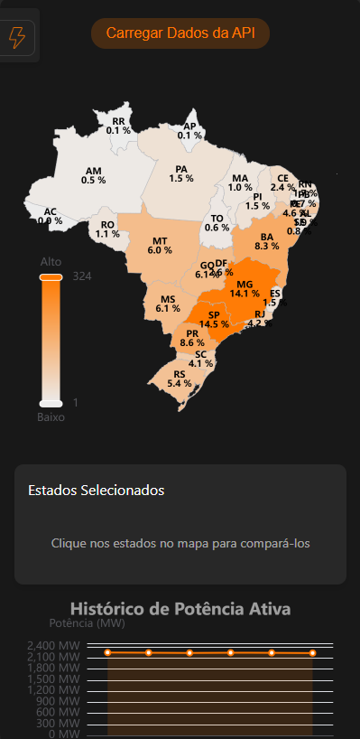

# API Map - Brazilian Energy Data Visualization

<div align="center">

**A full-stack application for real-time visualization of electricity generation data across Brazilian states**

[](https://vuejs.org/)
[](https://fastapi.tiangolo.com/)
[](https://www.python.org/)
[](https://www.docker.com/)

</div>

---

## Demo

<div align="center">

### Desktop Interface


### Mobile Interface


</div>

---

## About the Project

**API Map** is an energy data visualization platform that integrates information from the Brazilian National System Operator (ONS) into an interactive and intuitive interface. The application allows real-time monitoring of electricity generation in all Brazilian states through a colored heat map and historical charts.

### Key Features

- **Interactive Map of Brazil**: Geographic visualization with heat map based on power data
- **Real-Time Data**: Current active power and installed capacity by state
- **View Toggle**: Switch between active power and installed capacity
- **Power History**: Temporal chart showing the evolution of energy generation
- **State Comparison**: Select multiple states on the map to compare data
- **Responsive Interface**: Adaptive design for desktop and mobile devices
- **Visual Scale**: Color gradient from low (light) to high (intense orange)
- **Data Persistence**: Historical storage in SQLite database

---

## Architecture

```
┌─────────────────────────────────────────────────────┐
│              Frontend (Vue.js + Vite)               │
│         • Interactive map of Brazil                 │
│         • Charts with ECharts                       │
│         • Responsive interface                      │
└────────────────────┬────────────────────────────────┘
                     │ HTTP/REST API
                     ▼
┌─────────────────────────────────────────────────────┐
│           Backend (Python + FastAPI)                │
│         • Integration with ONS API                  │
│         • Data validation and processing            │
│         • Token-based authentication system         │
│         • Cache and request optimization            │
└────────────────────┬────────────────────────────────┘
                     │
                     ▼
┌─────────────────────────────────────────────────────┐
│              Database (SQLite)                      │
│         • Data history                              │
│         • Power data by state                       │
│         • Update timestamps                         │
└─────────────────────────────────────────────────────┘
```

## Project Structure

```
api-map/
├── backend/                     # Backend Python + FastAPI
│   ├── main.py                  # API entry point
│   ├── models.py                # Data models (Pydantic)
│   ├── database.py              # Database configuration and operations
│   ├── config.py                # Settings and environment variables
│   ├── ansi_colors.py           # Utilities for colored logs
│   ├── requirements.txt         # Python dependencies
│   └── Dockerfile               # Backend container
│
├── frontend/                    # Frontend Vue.js
│   ├── src/
│   │   ├── App.vue              # Root application component
│   │   ├── main.js              # Vue entry point
│   │   ├── brazil-states.json   # Brazil map GeoJSON
│   │   ├── eventBus.js          # Event system between components
│   │   ├── components/          # Vue components
│   │   │   ├── MapComponent.vue       # Interactive Brazil map
│   │   │   ├── LineChart.vue          # History chart
│   │   │   ├── StateCompare.vue       # State comparison
│   │   │   ├── FetchAPIButton.vue     # Load data button
│   │   │   ├── InfoViewer.vue         # Information viewer
│   │   │   ├── LoadingScreen.vue      # Loading screen
│   │   │   └── TotalSum.vue           # Power totalizer
│   │   ├── services/            # API services
│   │   │   ├── api.js           # HTTP client for backend
│   │   │   └── api_utils.js     # API utilities
│   │   └── assets/              # Static resources
│   ├── package.json             # Node.js dependencies
│   ├── vite.config.js           # Vite configuration
│   └── index.html               # Main HTML
│
├── docs/                        # Documentation and screenshots
│   ├── screenshot-desktop.png   # Desktop screenshot
│   └── screenshot-mobile.png    # Mobile screenshot
│
├── compose.yml                  # Docker orchestration
├── power_data.db                # SQLite database
└── README.md                    # This file
```

## Technologies Used

### Frontend
- **Vue.js 3.5** - Progressive JavaScript framework
- **Vite 7.1** - Modern and fast build tool
- **ECharts 6.0** - Interactive charting library
- **Axios** - HTTP client for requests
- **GeoJSON** - Geographic data of Brazil

### Backend
- **FastAPI** - Modern and fast Python web framework
- **SQLite** - Lightweight and efficient database
- **httpx** - Asynchronous HTTP client
- **Pydantic** - Data validation
- **python-dotenv** - Environment variable management

### DevOps
- **Docker & Docker Compose** - Containerization
- **CORS Middleware** - Cross-domain communication

## Recommended Setup

### IDE
[VS Code](https://code.visualstudio.com/) + [Vue (Official)](https://marketplace.visualstudio.com/items?itemName=Vue.volar) (disable Vetur if installed)

### Recommended Extensions
- **Python** - Python development support
- **Pylance** - Python static code analysis
- **Docker** - Container management

### Browser
- **Chromium** (Chrome, Edge, Brave, etc.):
  - [Vue.js devtools](https://chromewebstore.google.com/detail/vuejs-devtools/nhdogjmejiglipccpnnnanhbledajbpd) 
  - [Enable Custom Object Formatter in DevTools](http://bit.ly/object-formatters)
- **Firefox**:
  - [Vue.js devtools](https://addons.mozilla.org/en-US/firefox/addon/vue-js-devtools/)
  - [Enable Custom Object Formatter in DevTools](https://fxdx.dev/firefox-devtools-custom-object-formatters/)

## Prerequisites

Before starting, make sure you have installed:

- **Node.js**: v20.19.0 or v22.12.0+ ([Download](https://nodejs.org/))
- **Python**: 3.11 or higher ([Download](https://www.python.org/downloads/))
- **Docker & Docker Compose** (optional, for containerized deployment) ([Download](https://www.docker.com/))

## Quick Start

### Option 1: Using Docker (Recommended)

The fastest way to run the complete project:

```powershell
# 1. Clone the repository
git clone https://github.com/Bandeco03/api-map.git
cd api-map

# 2. Configure backend environment variables
# Copy the example file and edit with your ONS API credentials
cp backend/.env.example backend/.env
# Edit backend/.env with your preferred editor

# 3. Start the containers
docker-compose up

# 4. Access the application
# Frontend: http://localhost:5173
# Backend API: http://localhost:8000
# API Documentation: http://localhost:8000/docs
```

### Option 2: Local Execution (Development)

#### Backend Setup

```powershell
# 1. Navigate to the backend directory
cd backend

# 2. Create a Python virtual environment
python -m venv venv

# 3. Activate the virtual environment
.\venv\Scripts\activate  # Windows PowerShell
# source venv/bin/activate  # Linux/Mac

# 4. Install dependencies
pip install -r requirements.txt

# 5. Configure environment variables
cp .env.example .env
# Edit .env with your ONS API credentials

# 6. Run the backend server
python main.py
# Or use uvicorn directly:
# uvicorn main:app --reload
```

**Backend running at:** http://localhost:8000  
**API Documentation:** http://localhost:8000/docs

#### Frontend Setup

```powershell
# 1. In another terminal, navigate to the frontend directory
cd frontend

# 2. Install dependencies
npm install

# 3. Configure environment variables (optional)
cp .env.example .env
# Default already points to http://localhost:8000

# 4. Run the development server
npm run dev
```

**Frontend running at:** http://localhost:5173

## Production Build

### Frontend
```powershell
cd frontend
npm run build
```
Optimized files will be generated in the `dist/` directory

### Backend
The Python backend doesn't require a build step. For production:
```powershell
cd backend
pip install -r requirements.txt
python main.py
```

## API Endpoints

| Method | Endpoint | Description |
|--------|----------|-----------|
| `GET` | `/` | Root endpoint with API information |
| `GET` | `/api/power-data` | Fetch power data from all plants |
| `GET` | `/api/history` | Return stored historical data |
| `GET` | `/health` | Health check for monitoring |
| `GET` | `/docs` | Interactive documentation (Swagger UI) |
| `GET` | `/redoc` | Alternative documentation (ReDoc) |

### Response Example

```json
{
  "timestamp": "2025-11-25T10:30:00",
  "states": [
    {
      "code": "SP",
      "name": "São Paulo",
      "activePower": 14500.5,
      "installedCapacity": 22000.0,
      "percentage": 65.9
    }
  ],
  "totals": {
    "activePower": 132820.0,
    "installedCapacity": 220000.0
  }
}
```

## How It Works

### 1. Data Collection
The backend connects to the ONS API (National System Operator) to fetch real-time data on electricity generation from all plants in Brazil.

### 2. Processing
Data is processed, validated, and aggregated by state. The system maintains a complete history in an SQLite database.

### 3. Visualization
The frontend displays data through:
- **Heat map**: Colors range from beige (lower power) to intense orange (higher power)
- **Percentages**: Each state shows its percentage contribution to the national total
- **Temporal chart**: Timeline showing power evolution
- **Comparison**: Allows selecting states for comparative analysis

### 4. Interactivity
- Click on states on the map to select them
- Toggle between active power and installed capacity view
- Track generation history over time

## Environment Variables

### Backend (`backend/.env`)

```env
# ONS API Credentials (required)
API_ACCESS_KEY=your_access_key_here
API_SYS_CODE=your_sys_code_here
API_TOKEN=your_token_here
API_APPKEY=your_appkey_here

# Server Configuration
HOST=0.0.0.0
PORT=8000
DEBUG=True

# Database
DATABASE_URL=sqlite:///./power_data.db

# CORS (allowed origins)
CORS_ORIGINS=http://localhost:5173,http://localhost:3000
```

> **Important**: ONS API credentials are mandatory. Contact ONS to obtain access.

### Frontend (`frontend/.env`)

```env
# Backend URL
VITE_API_URL=http://localhost:8000
```

## ONS Data

This project uses the API from the **Brazilian National System Operator (ONS)** to obtain real electricity generation data. ONS is responsible for coordinating and controlling the operation of electricity generation and transmission in Brazil.

**Data source:** [ONS - National System Operator](https://www.ons.org.br/)

## Use Cases

- **Energy Monitoring**: Track energy generation in real-time
- **Education**: Educational tool to understand the Brazilian electrical system
- **Data Analysis**: Study generation patterns by region
- **Research**: Basis for studies on renewable energy and energy distribution
- **Business**: Support for decisions in the energy sector

## Roadmap

- [x] ONS API integration
- [x] SQLite database
- [x] Responsive interface
- [x] Interactive map of Brazil
- [x] History chart
- [ ] States table
- [x] Automatic update every 5 minutes
- [ ] Data export (CSV, JSON, PDF)
- [ ] Historical data comparison (temporal analysis)
- [ ] PostgreSQL integration
- [ ] Automatic backup system

## Troubleshooting

### Issue: Backend doesn't start

**Cause**: Missing ONS API credentials
```
[CRITICAL ERROR] Cannot start backend without required credentials!
```

**Solution**: Verify that all environment variables are configured in the `backend/.env` file

### Issue: CORS error in browser

**Cause**: Origin not allowed

**Solution**: Add the frontend origin to the `CORS_ORIGINS` variable in `backend/.env`:
```env
CORS_ORIGINS=http://localhost:5173,http://localhost:3000
```

### Issue: Data doesn't load on the map

**Cause**: Expired or invalid authentication token

**Solution**: The backend automatically renews the token. Check the backend logs for error messages.

### Issue: Port already in use

**Solution**:
```powershell
# Change the port in backend/.env
PORT=8001

# Change the frontend port in vite.config.js
# or use the --port flag
npm run dev -- --port 5174
```

## Contributing

Contributions are welcome! Follow these steps:

1. **Fork** the project
2. Create a **branch** for your feature (`git checkout -b feature/MyFeature`)
3. **Commit** your changes (`git commit -m 'Add MyFeature'`)
4. **Push** to the branch (`git push origin feature/MyFeature`)
5. Open a **Pull Request**

### Guidelines

- Keep the code clean and well documented
- Follow existing code standards
- Add tests when appropriate
- Update documentation as needed

## License

This project is under the MIT license. See the [LICENSE](LICENSE) file for more details.

## Author

**Rafael Bandini Silva**

- GitHub: [@Bandeco03](https://github.com/Bandeco03)
- LinkedIn: [Rafael Bandini Silva](https://www.linkedin.com/in/rafael-bandini/)

## Support

If you encounter any issues or have suggestions:

- Open an [Issue](https://github.com/Bandeco03/api-map/issues)
- Contact via LinkedIn
- Contribute with a Pull Request

---

<div align="center">

**Made with love and energy by Rafael Bandini Silva**

If this project was useful, consider giving it a star!

</div>

